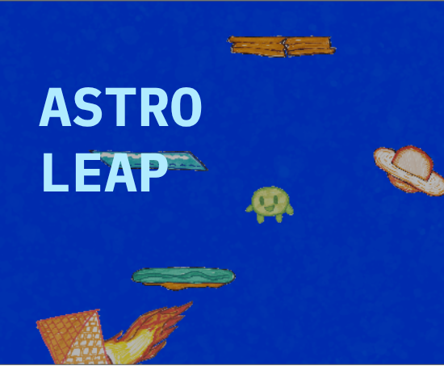
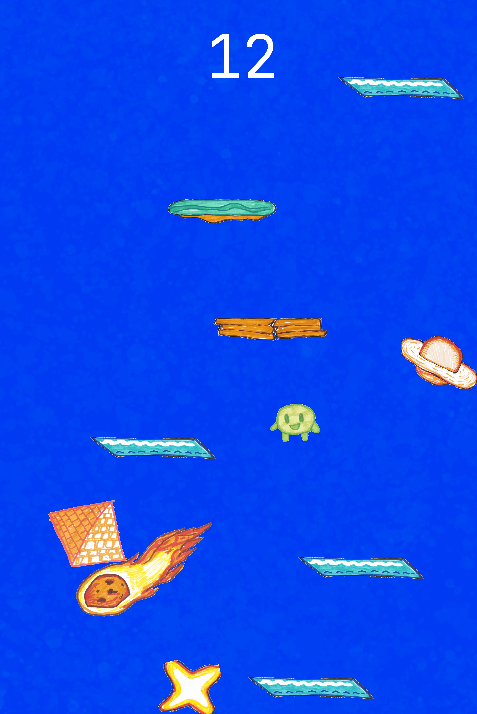

# Astro Leap

A simple infinite platformer game made using Godot.
## Screenshots

## Play Game
You can the finished game on itch.io using the following link: "https://akshay960.itch.io/astro-leap"

## Controls
* Use the left arrow key to move character left, and use right arrow key to move character right.

## How I made it
I used the Godot 2d engine to for the main framework for the game, and for the assets, I used the JetBrains Mono font for the game. I also hand-drew the assets and used edge detection software to remove 
 

## Credits
I used these external websites to help me on this project. 

* https://image.rustwindy.com/ for seperating the images
* http://docs.godotengine.org/en/stable/tutorials/2d/index.html for help with GDScript

